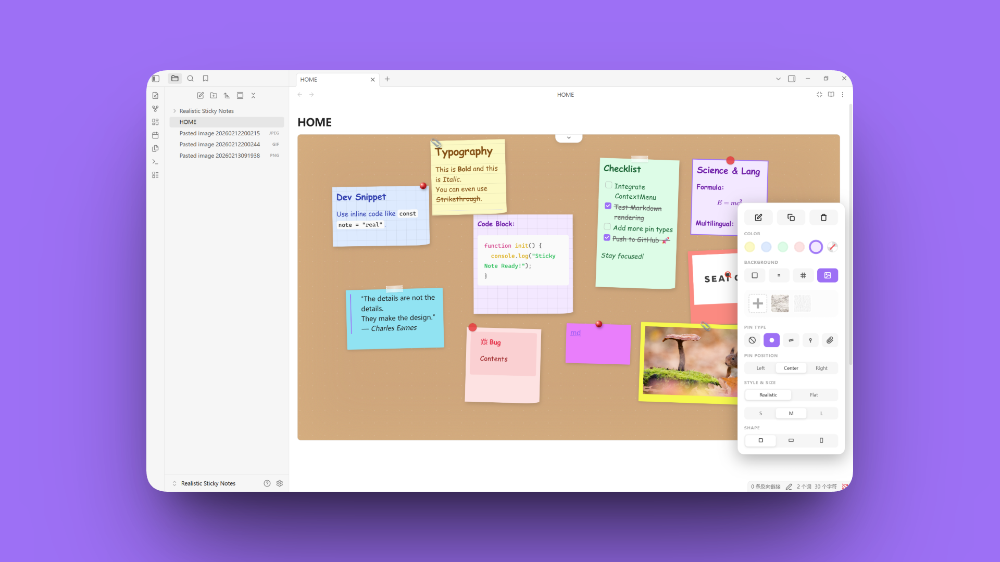

# Obsidian Realistic Sticky Notes

A highly realistic sticky note dashboard for Obsidian. Capture ideas as naturally as on a physical whiteboard, with **zero learning curve**.

[English](README.md) | [简体中文](./docs/README_zh_CN.md)

---

  <a href="https://www.youtube.com/watch?v=qLsNvQLTyyg">
    
     
    <b> Click to Watch the Demo Video on YouTube</b>
  </a>

---

## Feature Highlights

### Realistic Sticky Notes

- **Zero Syntax:** Double-click to create or edit notes instantly. You can also copy and paste notes directly.

- **Deep Customization:** Fully customize the **Style**, **Size**, **Pin Type** (Tape, Pin, Clip, or Circle), **Background** (Solid, Lined, Grid, or Custom Images), **Color**, and **Shape**.

- **Full Markdown Support:** Seamlessly use Obsidian's native Markdown syntax inside notes, including support for pasted images and GIFs.

- **Cross-Platform:** Optimized for a smooth experience on both iOS and Android mobile devices.

### Board Management

- **Smart Views:** Toggle between **Overview Mode** and **Center View**. Easily switch between **Aligned** or **Random Rotation** for that authentic "messy" whiteboard look.

- **Multiple Boards:** Pre-set with 6 board backgrounds. Create, manage, or delete multiple independent boards and adjust the canvas height to fit your needs.

- **Focus Mode:** Toggle a "Narrow Width" option from the toolbar to maximize your workspace (affects the current board file only).

### Transparent Data Storage

- **Secure & Open:** Every sticky note's data is stored as an **independent .md file** within your vault, ensuring your data remains human-readable and future-proof.

---

## How to Use

1. Open any `.md` file and enter **Editing Mode**.

2. Trigger the command (via Command Palette) to insert the Sticky Notes panel.

3. **Double-click** any empty space to create a new note.

4. **Right-click** a note to access the context menu for styling, copying, or deleting.

---

## Support the Developer

If this plugin helps you stay organized and inspired, consider supporting its development. Your "coffee" helps **SumuS(素木生)** keep this project free and open-source!

---

## License

Licensed under the **AGPL-3.0 License**. Contributions and PRs are always welcome!
